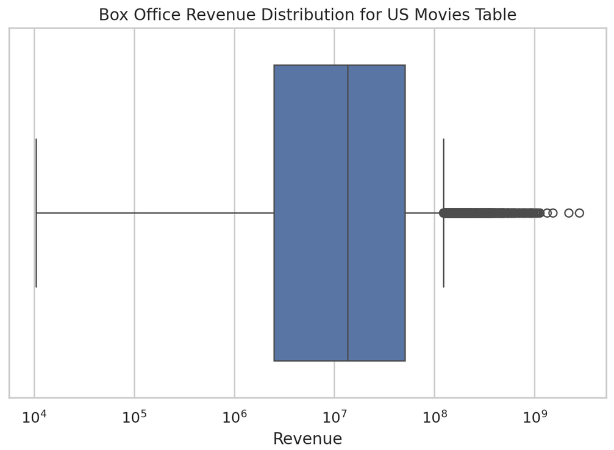
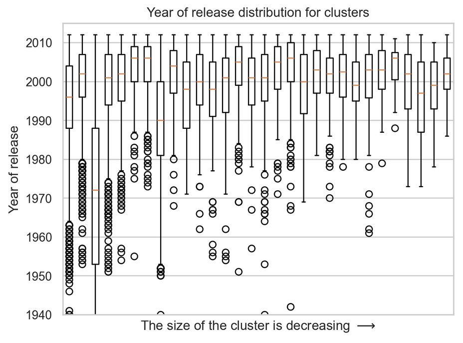

In today’s competitive job market, leveraging professional networks is crucial for securing top-tier positions. But **does the same apply to movie actors, where education might not play such a significant role?** To explore this, we examine whether an actor’s professional community shapes their success. We build a graph where vertices represent actors, and edges connect those who have appeared in a movie together, **symbolizing a "friendship" between them**. By clustering actors into communities, we investigate the role of friendships in shaping career trajectories. Our analysis focuses on the U.S. movies but extends to films from other countries to determine if the conclusions are universal. This study aims to reveal whether an actor’s community significantly impacts their career outcomes and how friendship patterns vary across time and countries.

---

# Starting our investigation

As in any research, we need some data to do analysis and base our conclusions on. For this study, we utilize [CMU Movie Summary Corpus](http://www.cs.cmu.edu/~ark/personas/) that includes 81741 movies with their Wikipedia-based plot summaries and Freebase-based metadata, including revenue, genre, release data, runtime, language, country of origin, and information about movie characters and corresponding actors (date of birth, age, height, ethnicity, and gender).

The traditional career path of an actor can be different in different countries. To begin with, let's focus on the USA movies and their actors. By conducting analysis on a certain region, we ensure that the in-depth concepts and flows of actors' career are kept, hence, providing comprehensive analysis and meaningful conclusions. After filtering, we obtain 6923 movies to work on.

Before going into actors' analysis, let's look how our data is distributed.

<div style="text-align: center;">

</div>

We see that most of the included movies were produced in 2000 and 80-90s. While such uneven distribution is usually considered harmful for the analysis, we believe it is still meaningful here. Indeed, the cinematography industry is developing and more and more movies are being produced. The sudden drop in 2010s is due to the date of dataset creation, i.e., 2013.

<div style="text-align: center;">

</div>

The revenue (in $$ \$ $$) can vary, but it is centered around $$ \sim 10M $$ \$ $$.

<div style="text-align: center;">

</div>

Many genres are represented in the dataset with Drama and Comedy being the most often ones.

We can also connect movie information with the actors that played it. Such analysis will be the core of following sections. For example, we can look at the famous Harrison Ford:

<div style="display: flex; justify-content: center; align-items: center;">
<div class="card">
  <div class="card__image">
    
  </div>
  <div class="card__content">
    <div class="card__header">
      <h4>Played in 35 movies.
      <ul>
         <li> Favourite genre: Drama (23 movies). </li>
         <li> Total movie revenues:    6,397,871,819$. </li>
         <li> Average movie revenue:     182,796,338$. </li>
      </ul>
      </h4>
    </div>
  </div>
</div>
</div>

We can also look at the general distributions, like a pie chart for the actors' gender:

```chart
{
  "type": "pie",
  "data": {
    "datasets": [
      {
        "data": [35.8, 64.2],
        "backgroundColor": [
          "#FF6384",
          "#36A2EB"
        ],
        "label": "Gender"
      }
    ],
    "labels": [
      "Female",
      "Male"
    ]
  },
  "options": {}
}
```

# Creating a Graph

Now that we have a full view on our data, we can connect it with the information about the actors. We want to investigate the impact of actors' connections and community on their career. How can we create a computational model for that?

Let's say that two actors are "friends" if they have a mutual movie. Hence, we obtain a classical interpretation of a graph data and can use it as our computational model: vertices are defined by unique actor names and edges connect actors if they are friends (i.e., participated in the same movie).

By utilizing [Louvain algorithm](https://arxiv.org/pdf/0803.0476) for clustering graph data, we split our vertices into 133 different communities. For each actor, we know the movies this actor participated in. Therefore, we can even calculate movie-wise statistics for our communities! We just take all the movies the cluster's actors participated at and calculate total/average value.

# Research Questions

## Revenue and Actors' Awards/Nominations

_How one could measure the success of an actor?_ We believe there are two ways to do so:

1. Great actors receive great awards, such as [Oscars](https://www.oscars.org/) or [Golden Globes](https://goldenglobes.com/).
2. Great actors lead to movie success and successive high revenue.

The awards data is not presented in the CMU dataset, therefore we take it from [Wikidata](https://www.wikidata.org/) via our [SPARQL scrapping algorithm](https://github.com/epfl-ada/ada-2024-project-d2ptm/blob/main/scrape_awards.py) and actors' FreebaseID from the CMU movie dataset. We scrape both the awards and the nominations. We focus on the USA-related awards.

For humans, it is usual that their community and surrounding matters a lot on their life-path. But **does it hold true for the actor's career?** Let's leverage awards data and calculate the proportion of actors with awards or nominations in each community:

<div style="text-align: center;">

</div>

Note that for the very small (in terms of number of actors) clusters the density can vary from $$0$$ to $$1$$ a lot. Given that we have 30378 vertices in our graph, these clusters with less than $$20$$ actors are not very representative. However, if we look at the communities with more than $$20$$ people, we see a linear correlation (linear for log-scale x-axis) between the density and cluster size. To support this idea we trained a linear regression model on log-scale cluster sizes as input. The depicted orange line represents the models' predictions which result in $$0.19 R^2$$ score and positive slope. This indicates that, indeed, the number of awards within the community rises as the community grows. But **how the number of awards can increase as the community gets new members?** There are only two ways:

1. Actors that have already been in the community got an award. This indicates that being in a community with other nominees\winners may increase your chances of getting nomination\award yourself.
2. New actors that joined a community already had an award. This means that nominated actors tend to play together with other successful actors.

The box plot on the right also suggests that for non-anomalous clusters (with more than $20$ people, referred to as "filtered clusters") the expected proportion of awarded actors is around $$10\%$$ indicating high chances for actors to actually get an award or nomination.

Let's look at the relation between the revenue and awards. How often have you seen movie trailers advertising themselves via showing that their actors have cool awards, such as Oscars? We guess, a lot. Awards and nominations are not given for nothing. They highlight the skills and experience of an actor. People want to have trust in the movie because they pay for it. The well-known and awarded actors improve this factor and can attract more visitor to the cinemas. Let's verify this intuitive claim using our data:

<div style="text-align: center;">

</div>

This looks familiar, yes? It recalls of an exponent (or line without log-scale x-axis). By calculating [Pearson's](https://en.wikipedia.org/wiki/Pearson_correlation_coefficient) and [Spearman's](https://en.wikipedia.org/wiki/Spearman%27s_rank_correlation_coefficient) correlation coefficients, we obtain $$0.90$$ and $$0.69$$, respectively. We also train a linear regression model that predicts revenue from the number of awards and nominations (we do not use log-scale for input) and get $$R^2=0.82$$. Thus, we see a positive (more or less monotonic) linear correlation that support our intuitive finding: hiring winners and nominees should increase the expected revenue.

Now that we understood how awards can affect the career, let's look more on the second factor: revenue.

<div style="text-align: center;">

</div>

We see that there is no linear or monotonic correlation (Pearson's and Spearman's correlation are equal to $0.12$ and $0.13$, respectively), however, the biggest (revenue-wise) movies seem to have more balanced proportions of male and female actors.

<div style="text-align: center;">

</div>

Similarly, there is no indication of linearity or monotonicity, however, the communities with an average age between 30 and 40 tend to have higher revenue.

But **what about the most successful (revenue-wise) cluster?** We take the community with the highest median revenue (we found median to be more representative than mean).

<div style="text-align: center;">

</div>

This group of actors has about the same gender proportions as the whole industry. In terms of age, this cluster is slightly younger than the rest of the industry:

<div style="text-align: center;">

</div>

"Drama", "Thriller", "Comedy", "Action" and "Adventure" are the prefered genres in this actor group, as we can see from the bar-plot below.

<div style="text-align: center;">

</div>

But **what actors actually contribute the most?** While this can be interpreted as finding an actor with the highest total revenue or the most awards, we look at it in the more social way. That is, we aim to find an actor that community relies on, that actually makes this community connected. Let's assign a level of "importance" for each actor depending on the connectivity property. We combine [Katz](https://en.wikipedia.org/wiki/Katz_centrality), [Closeness](https://en.wikipedia.org/wiki/Closeness_centrality), and [Betweenness](https://en.wikipedia.org/wiki/Betweenness_centrality) centrality metrics to get an overall impact of each actor. This results in a graph with weighted nodes, depicted below. The bigger the node, the more important it is.

<iframe src="assets/images/smaller_graph.html" width="100%" height="500px" frameborder="0">
   <!-- Fallback content for browsers that do not support iframe -->
   Your browser does not support iframes.
</iframe>

## The impact of time

At the beginning, we saw that our dataset has uneven distribution of movies in terms of release year. One may argue that this could be harmful for our analysis and bias the results. For example, it is normal for 00s movie to get hundreds of millions of dollars, while such numbers were hard to get in the 50s. But **how does our clustering algorithm split the data time-wise?**. Let's look at the distribution of release years for the communities. To provide a clear idea without anomalies, we will focus only on the clusters with at least 50 movies (i.e., actors in this cluster participated in at least 50 movies at total).

<div style="text-align: center;">

</div>

We get that most of the clusters have high density and average around 2000. So, overall, clusters are not spread in time. This means that we are not biased even though the original data distribution was uneven.

Another interesting question could be: _"How the clusters evolve in time?"_, meaning that the community may change somehow after the addition or removal of movies with a certain release year. However, the box-plot above indicates that our clustering is not very dependant on time.

# Conclusion

We also wanted to investigate the generalization of our findings on the non-US movies. However, the CMU dataset suffers from the absence of metadata for other countries, as you can see from the plot below. Here, we look at a language, not at a country, to provide a more general view on the problem (countries have even less movies than the number of movies for the language in this country). The revenue feature is vital for our analysis and having only around $$100$$ movies is not enough to have faithful conclusions.

<div style="text-align: center;">

</div>
